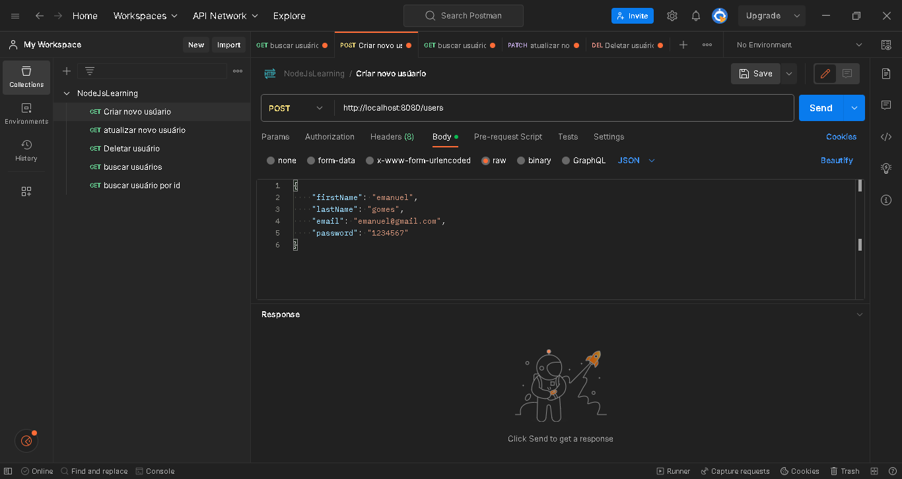
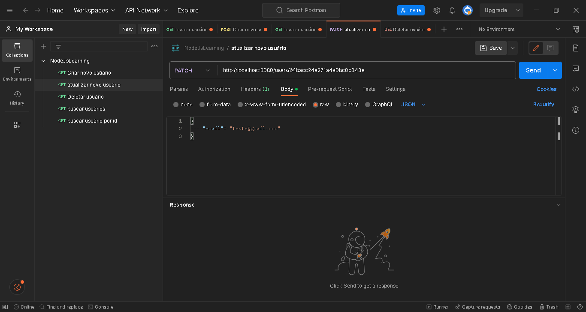
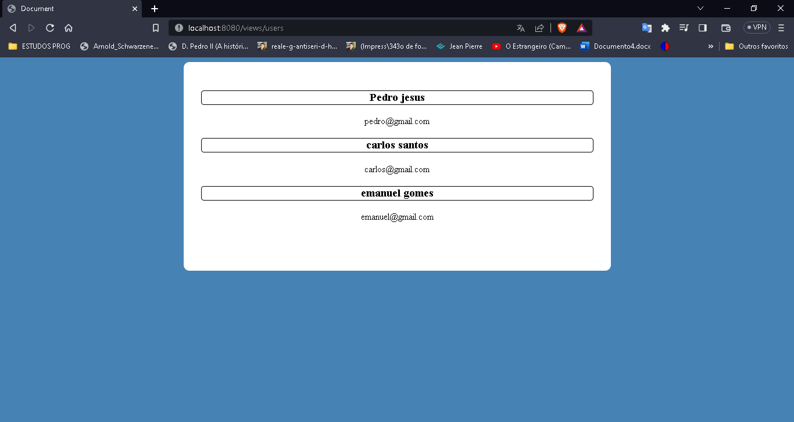

<h1 align="center"> Server user manager </h1>

This project consists of a user manager server made with node.js and a mongoDB database that stores and handles name, email, password data and assigns an id to each one. 

  <a href="#🚀-technologies">Technologies</a>&nbsp;&nbsp;&nbsp;|&nbsp;&nbsp;&nbsp;
  <a href="#💻-project">Project</a>&nbsp;&nbsp;&nbsp;|&nbsp;&nbsp;&nbsp;

 

  

## 🚀 Technologies

This project was developed with the following technologies:

- NODE.js
- MongoDB
- Modules Express, mongoose and EJS
- Javascript, Html, Css

## 💻 Project

In this server there are the main necessary functionalities, such as adding, deleting, viewing and modifying users using mainly the 'express' library. Each with it's specific directory

The server only stores information if they are in accordance with the pre-established scope and does all data processing in JSON.

Finally, there is a web page to exemplify the connection with the front-end. This page shows the users and their updated emails.

- Access the finished project online: https://github.com/Carlos-EduardoAlmeida/NodeServer

---

Made by Carlos Eduardo De Almeida Silva